# Tic Tac Toe

Tic Tac Toe is a classic two-player game implemented as a terminal-based Python application. This project is designed to run in the Code Institute’s mock terminal environment, hosted on Heroku. The game offers an interactive and engaging experience directly from the command line.

The objective of the game is simple: the user plays against the computer, taking turns to place their symbol (X or O) on a 3x3 grid. The first player to align three of their symbols horizontally, vertically, or diagonally wins the game. If the grid is filled without a winning combination, the game ends in a draw.

This project demonstrates fundamental Python programming concepts such as loops, conditionals, functions, and basic AI logic for the computer's moves. It provides a fun and challenging way for users to test their strategy and logic skills.

The game is lightweight, user-friendly, and ideal for showcasing terminal-based interactivity in Python.

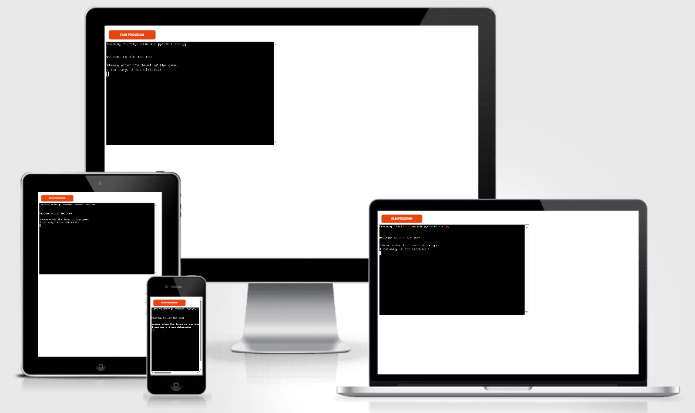

## Project Goals

The primary goal of developing Tic Tac Toe was to apply core Python programming skills to create an interactive and strategic terminal-based game. This project served as a platform to:

- Strengthen Core Python Skills: Reinforce knowledge of functions, loops, conditionals, and data structures through practical application in game logic.

- Apply Object-Oriented Programming (OOP): Structure the game using classes and objects to improve modularity, readability, and scalability of the code.

- Enhance User Interaction in the Terminal: Create a smooth and intuitive user experience within a command-line interface, focusing on clarity and ease of use.

- Deliver a Classic Game with a Personal Touch: Reimagine the timeless game of Tic Tac Toe with clean code structure and user-centered design.

## How to play

- Start the game and choose the difficulty

    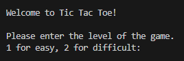
    - 1 = Easy (computer makes random moves)
    - 2 = Difficult (computer makes smart moves)

- You play as 'x', the computer plays as 'o'.

- Pick a cell by entering a number (1–9) based on this layout:

    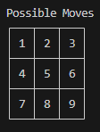

- The first to get three in a row wins.

    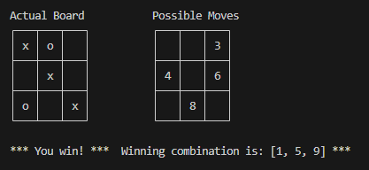

- A full board with no winner is a draw.

    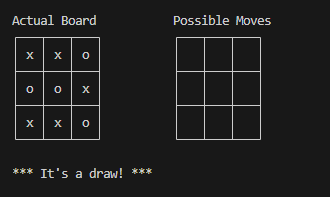

- At the end of the game, you can play again or exit.

    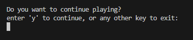

## Technologies used

- **Python**: The primary programming language used to develop this game.

- **Git and GitHub**: Used Git for version control, allowing for collaboration and tracking of code changes on GitHub.

- **Heroku**: Deployed the game on Heroku's server, making it accessible to anyone with an internet connection.

- **VSCode**: Mainly used as the primary text editor for writing the game code.

## Features

### Existing Features

- Single-player mode against the computer

- Two difficulty levels: Easy and Difficult

- Interactive CLI interface with a clear 3×3 board layout

- Replay option after each round

- Score tracking for user and computer

- Move validation to prevent invalid inputs

- Winning combination display after each round

### Future Feature

- Add impossible level (minimax algorithm)

## Testing

### Code Institute Python Linter

run.py PEP8 Compliance

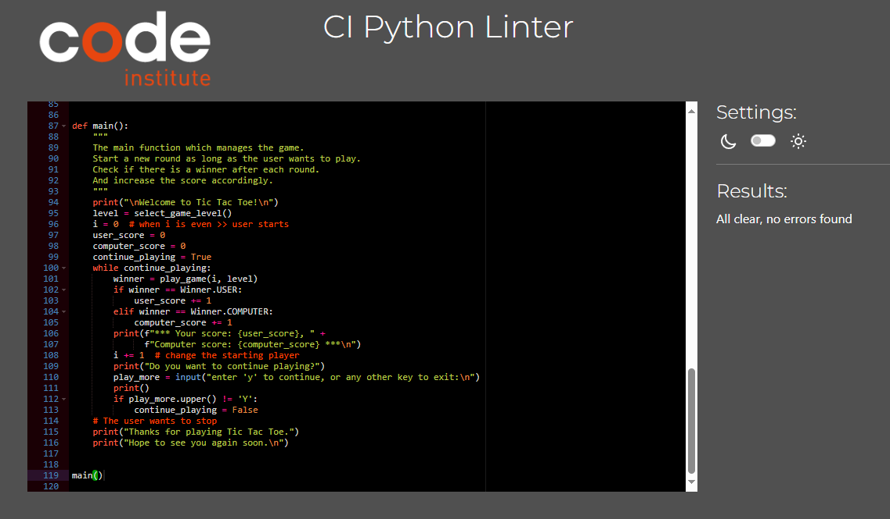

board.py PEP8 Compliance

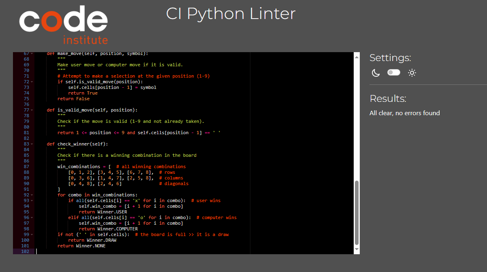

computer.py PEP8 Compliance

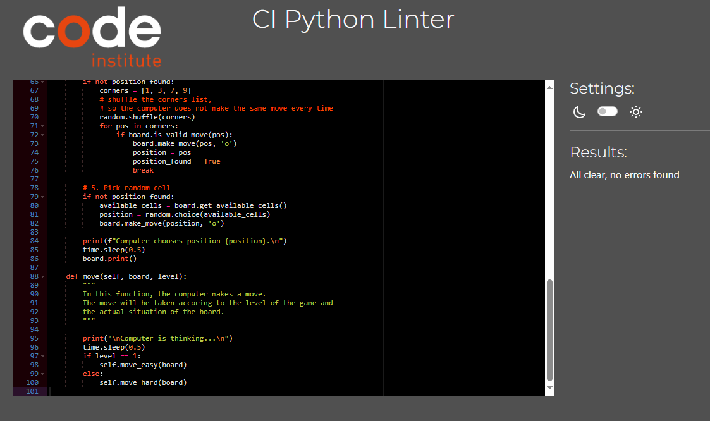

enums.py PEP8 Compliance

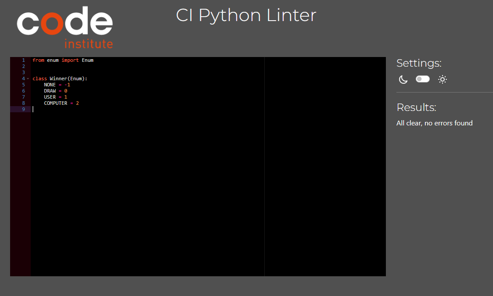

### Manual Testing

- Given invalid inputs for the level and get a proper error message.

    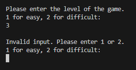

- Given invalid move and get a proper error message.

    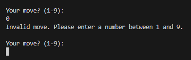

## Bugs

- The first time I wrote the function "get_available_cells", I did a mistake and the the funciton returned always the first available cell.

## Deployment and development

### Cloning the project

1. Install Git: If Git is not already installed on your system, you can download it from the official Git website and follow the setup instructions specific to your operating system.
2. Create project folder `mkdir tic-tac-toe`
3. Change to the project directory `cd tic-tac-toe`
4. Clone the repository `git clone https://github.com/salah929/tic_tac_toe .`

### Running the game in terminal

1. Open your terminal and change directory to the cloned project folder.
2. Install the required packages with `pip install -r requirements.txt`
3. Run the game `python run.py`

### Deploying the Game to Heroku

1. Login or Create Heroku Account: If you don't have one, create a Heroku account. Otherwise, log in to your existing account.
2. Create New App: From the Heroku dashboard, click the "New" button in the top right corner. Select "Create new app" from the drop-down menu.
3. Name and Region Selection: Choose a unique name and select the region.
4. Add buildpacks: Navigate to Buildpack and click Add Buildpack to add Python and nodejs. Ensure that the python buildpack is above the Nodejs buildpack.
5. Deploy from GitHub: Navigate to the "Deploy" section by clicking the "Deploy" tab in the top navbar. Select "GitHub" as the deployment method and connect your GitHub repository by searching for its name in the search bar. Click "connect" to link the repository to Heroku.
6. Deploy Branch: Scroll down and click "Deploy Branch" to initiate the deployment process. Heroku will notify you once the app is deployed, and you'll be provided with a button to view the deployed app.

## Credits

- [code institute template](https://github.com/Code-Institute-Org/python-essentials-template) to start the project
- [code institute CI Python Linter](https://pep8ci.herokuapp.com/) to check the code for PEP8 compliance